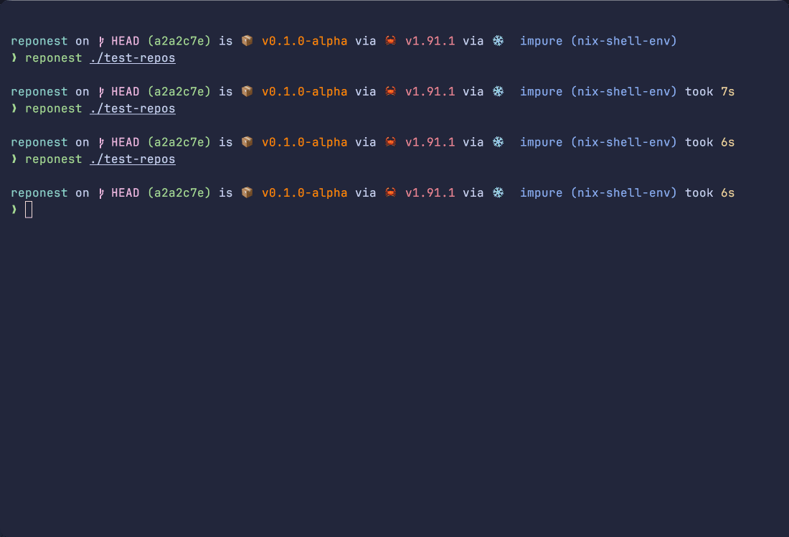

<div align="center">

# 🪺 RepoNest

**A multiple Git repositories/projects manager with TUI & CLI interfaces**

**Don't forget to tend your repos!**

[](https://crates.io/crates/reponest)
[](https://docs.rs/reponest)
[](LICENSE.md)
[](https://www.rust-lang.org/)
[](https://github.com/peoxin/reponest/actions/workflows/ci.yml)
[](https://github.com/peoxin/reponest/releases)

[Installation](#installation) •
[Quick Start](#quick-start) •
[Features](#features) •
[Configuration](#configuration) •
[Documentation](#documentation)

---



*Monitor all your Git repositories at a glance*

</div>

> [!NOTE]
> **🚧 Work in Progress**
> 
> RepoNest is under active development and not yet production-ready. There's still plenty of work to be done before the first stable release. Despite this, you're welcome to try it out and share your feedback!

## Roadmap

- [x] Core functionality: scan Git repositories, gather status
- [x] Basic TUI interface with Ratatui
- [x] Basic CLI commands: `list`
- [x] Configuration file support
- [ ] Preset themes for TUI
- [ ] Support non-Git projects with specific status info
- [ ] More opening actions
- [ ] Remote repository status integration (GitHub, GitLab, etc.)
- [ ] Performance: smarter and faster scanning, faster status gathering
- [ ] Support jujutsu repositories
- [ ] ...

## Features

- **Lightning Fast** — Parallel repository scanning with async I/O and multi-threaded Git operations
- **Beautiful TUI** — Interactive terminal interface built with Ratatui, featuring real-time updates
- **Scriptable CLI** — Automate workflows with powerful command-line flags
- **Smart Discovery** — Recursively finds all Git repositories with configurable depth and exclusions
- **Rich Insights** — Track branches, commits, changes, stashes, and remote status at a glance
- **Highly Configurable** — TOML-based configuration with sensible defaults
- **Zero Dependencies** — Single binary, no runtime required

## Installation

### From Source

```sh
git clone https://github.com/peoxin/reponest.git
cd reponest
cargo install --path .
```

### Using Cargo

```sh
cargo install reponest
```

### Pre-built Binaries

Download from [Releases](https://github.com/peoxin/reponest/releases)

## Quick Start

### TUI Mode (Default)

Launch the interactive terminal interface:

```bash
# Auto scan all repositories in home directory
reponest

# Scan specific path
reponest ~/projects
```

**Note:** To enable `o` (cd to repository) functionality, source the wrapper script in your shell: `examples/shell_wrapper.sh`

### CLI Mode

Perfect for scripts and automation:

```bash
# List all repositories
reponest list

# Only find dirty repositories
reponest list --dirty

# Show detailed info for repos in a specific path
reponest list --detail ~/projects
```

For more CLI options, run:

```bash
reponest --help
```

## Configuration

RepoNest looks for configuration at:

| Platform | Path |
|----------|------|
| Linux/macOS | `~/.config/reponest/config.toml` |
| Windows | `%APPDATA%\reponest\config.toml` |

You can find an example config file at `examples/config.toml`.

## Documentation

To be added!

## Contributing

Contributions are welcome! Please feel free to submit a Pull Request. See [CONTRIBUTING.md](CONTRIBUTING.md) for guidelines.

## Acknowledgments

Built with amazing Rust libraries:
- [Tokio](https://tokio.rs) — Async runtime
- [Ratatui](https://ratatui.rs) — Terminal UI framework
- [libgit2](https://libgit2.org) — Git implementation
- [Rayon](https://github.com/rayon-rs/rayon) — Data parallelism

Thanks for [GitUI](https://github.com/gitui-org/gitui) and [gfold](https://github.com/nickgerace/gfold) for showing how to build Git related tools in Rust!

## Support

- [Report Issues](https://github.com/peoxin/reponest/issues)
- [Discussions](https://github.com/peoxin/reponest/discussions)
- Star the project if you find it useful!

## License
    
This project is licensed under the [MIT License](LICENSE).
